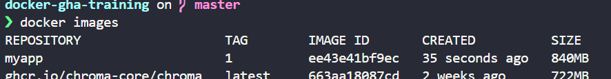
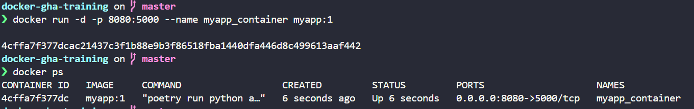
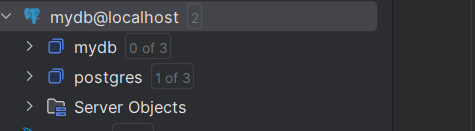

# Docker GHA Training

The goal of this training is to learn how to use Docker and GitHub Actions to build, test and deploy a simple web application. In this training, we will use a simple web application written in Python and Flask.

## License

This project is licensed under the MIT License - see the [LICENSE](LICENSE) file for details.

## FRIN Arthur

### 1 docker image creation
1. le repo n'est pas privé pck github ne le permet pas sur les forks publics.

3. l'image a bien été créée: 

5. le container run bien: 

note: j'ai juste fait une modification dans main.py:
```py
if __name__ == '__main__':
    app.run(debug=True)
```
deviens
```py
if __name__ == '__main__':
    app.run(host="0.0.0.0", port=5000)
```

pour pouvoir acceder a l'app depuis localhost:8080
---

### Docker compose Configuration

2. j'ai utilisé des docker secrets pour les credentials de la db:

creer un dossier `secrets` a la racine avec 3 fichier: pg_db pg_user et pg_password

elle run bien: screen de datagrip avec la db: 


